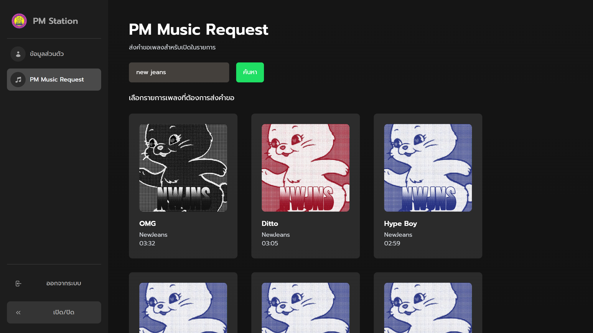

# PM Station Project - Website

เว็บไซต์ของโครงการวิทยุเสียงตามสาย PM Station โดยคณะกรรมการนักเรียนฝ่ายเทคโนโลยีสารสนเทศ โรงเรียนมัธยมสาธิตวัดพระศรีมหาธาตุ มหาวิทยาลัยราชภัฏพระนคร



## การเข้าถึง (Access)

สามารถติดตามรายละเอียดเกี่ยวกับโครงการและเข้าสู่เว็บไซต์ได้ทาง [IG @coolkidssatit](https://instagram.com/coolkidssatit/)


## โครงสร้างของโครงการ (Project Structure)

โครงการนี้มีลักษณะเป็น Monorepo ที่ประกอบด้วยแพ็คเกจ (Package) หลายแพ็คเกจใน Repository เดียว โดยโดยโฟลเดอร์ที่สำคัญประกอบด้วย

1. `apps` เป็นโฟลเดอร์สำหรับเว็บไซต์และแอปพลิเคชั่นทั้งหมดของโครงการนี้
    * `client-web` เว็บไซต์หลักของโครงการ
    * `kiosk-web` เว็บไซต์เสริมสำหรับรายงานสถานะการจัดรายการแบบ Real Time
2. `packages` เป็นโฟลเดอร์สำหรับโค้ดที่ใช้ร่วมกันภายในเว็บไซต์ โดยแบ่งออกเป็นแพ็คเก็จย่อย ๆ เพื่อความเป็นระเบียบและความสะดวกในการใช้งาน

## การพัฒนาบนเครื่อง (Local Development)

> เอกสารฉบับนี้จะสมมติว่าผู้ใช้งานกำลังพัฒนาบน Windows

ติดตั้ง [Node.js](https://nodejs.org/en/download), [Yarn (Classic)](https://classic.yarnpkg.com/en/docs/install) และ [Git](https://git-scm.com/)

> กรณีใช้ Windows ให้ติดตั้ง [Windows Terminal](https://aka.ms/terminal)
> หากใช้งาน Windows 11 โปรแกรม Windows Termimal จะติดตั้งไว้อยู่แล้ว

เข้าสู่ Terminal และพิมพ์คำสั่ง

```bash
git clone https://github.com/coolkidssatit/pm-station.git
cd pm-station
```

ติดตั้ง Dependencies ที่จำเป็นด้วย Yarn

```
yarn
```

## การมีส่วนร่วม (Contributing)

TODO

## ลิขสิทธิ์ (License)

MIT
